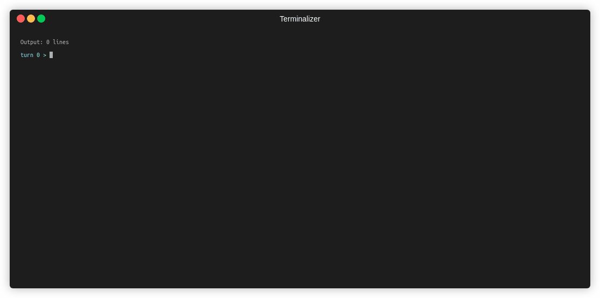

# Textual Engine

This is a text adventure engine for the CLI and browsers.

See [the demo on Github Pages](https://ssube.github.io/textual-engine/) or [the getting started docs](docs/getting-started.md) for more info.

[](https://ssube.github.io/textual-engine/)

## Features

- text
- adventure
- worlds:
  - contextual verbs
  - item modifiers
  - persistent rooms
  - procedural expansion
  - wandering monsters
  - save and load
- engine:
  - entity scripts
  - event broadcast
  - localization of both input and output (with [i18next](https://github.com/i18next/i18next))
  - multiple data sources (fetch and file in Node CLI, fetch and page element in browser)
  - multiple rendering engines ([readline](https://nodejs.org/api/readline.html), [Ink](https://github.com/vadimdemedes/ink), and [React](https://github.com/facebook/react/))
- planned:
  - natural language processing for input
  - world editor for React browser UI

## Contents

- [Textual Engine](#textual-engine)
  - [Features](#features)
  - [Contents](#contents)
  - [Building](#building)
  - [Playing](#playing)
  - [Docs](#docs)
  - [License](#license)

## Building

Some `make` targets are provided:

- `make build`: transpile Typescript sources
- `make test`: build and run `mocha` tests
- `make cover`: run `make test` with `nyc` code coverage

## Playing

[A recent version of the game is available on Github Pages](https://ssube.github.io/textual-engine/).

If you have a copy of this repository checked out, the `make run` target will build and launch the game on the CLI,
using the Ink rendering engine and demo world.

If you prefer to run a Docker image, the latest build is published as `ssube/textual-engine:master-stretch`, and can
be run with:

```shell
> docker run --rm -it ssube/textual-engine:master-stretch \
  --config data/config.yml \
  --data file://data/base.yml
```

## Docs

More detailed docs [are located in `./docs`](docs/).

Available documentation includes:

- [Engine Architecture](docs/architecture.md)
- [Development Workflow](docs/development.md)
- [Getting Started](docs/getting-started.md)
- [Creating Worlds](docs/world-templates.md)

## License

This project uses [the MIT license](LICENSE.md).
