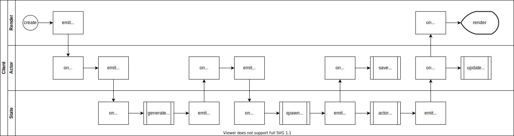
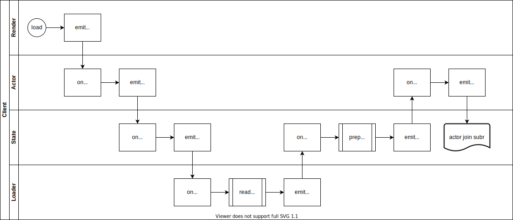
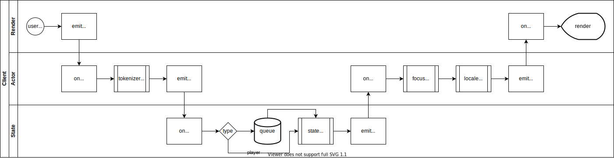
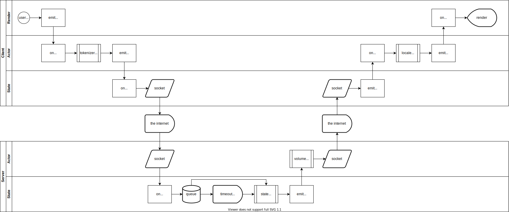

# Architecture

This guide covers the engine architecture and what role each service type plays.

## Contents

- [Architecture](#architecture)
  - [Contents](#contents)
  - [Commands](#commands)
    - [Command Tokenization](#command-tokenization)
    - [Common Commands](#common-commands)
    - [Meta Commands](#meta-commands)
    - [Custom Verb Commands](#custom-verb-commands)
  - [Entities](#entities)
    - [Actor Entity](#actor-entity)
    - [Item Entity](#item-entity)
    - [Room Entity](#room-entity)
      - [Room Portal Entity](#room-portal-entity)
  - [Events](#events)
    - [Event Flow: Creating a New World](#event-flow-creating-a-new-world)
    - [Event Flow: Loading an Existing World](#event-flow-loading-an-existing-world)
    - [Event Flow: Command with Local State](#event-flow-command-with-local-state)
    - [Event Flow: Command with Remote State](#event-flow-command-with-remote-state)
  - [Modules](#modules)
    - [Browser Module](#browser-module)
    - [Core Module](#core-module)
    - [Node Module](#node-module)
  - [Services](#services)
    - [Actor Service](#actor-service)
      - [Behavior Actor](#behavior-actor)
      - [Player Actor](#player-actor)
    - [Counter Service](#counter-service)
      - [Local Counter](#local-counter)
    - [Event Service](#event-service)
      - [Node Event Bus](#node-event-bus)
    - [Loader Service](#loader-service)
      - [Browser Fetch Loader Service](#browser-fetch-loader-service)
      - [Browser Page Loader Service](#browser-page-loader-service)
      - [Node Fetch Loader Service](#node-fetch-loader-service)
      - [Node File Loader Service](#node-file-loader-service)
    - [Locale Service](#locale-service)
      - [Next Locale](#next-locale)
    - [Parser Service](#parser-service)
      - [YAML Parser](#yaml-parser)
    - [Random Service](#random-service)
      - [Alea Random](#alea-random)
      - [Math Random](#math-random)
    - [Render Service](#render-service)
      - [Browser DOM Render Service](#browser-dom-render-service)
      - [Node Line Render Service](#node-line-render-service)
      - [Node Ink Render Service](#node-ink-render-service)
    - [Script Service](#script-service)
      - [Local Script](#local-script)
    - [State Service](#state-service)
      - [Local State](#local-state)
    - [Template Service](#template-service)
      - [Chain Template](#chain-template)
    - [Tokenizer Service](#tokenizer-service)
      - [Natural Tokenizer](#natural-tokenizer)
      - [Word Tokenizer](#word-tokenizer)
  - [Scripts](#scripts)
    - [Script Context](#script-context)
      - [Script Target (`this`)](#script-target-this)
      - [Scope Data](#scope-data)
    - [Slots](#slots)
    - [Verbs](#verbs)

## Commands

The player's input lines are parsed into commands for the actor to execute. NPC AI generates input commands directly.

### Command Tokenization

Commands are built by splitting input on whitespace, removing articles (a, an, the, etc) and other filler words, and
assuming the verb and target are in the correct order. Some validation is done when invoking commands, but the parsing
is very simple.

### Common Commands

There are common verbs built into the engine for actions such as:

- `drop` an item
- `hit` an enemy
- `look` at an entity
- `move` to another room
- `take` an item
- `use` an item
- `wait` the turn

### Meta Commands

There are some meta commands that are handled by the state service, rather than actor scripts.

- `create`
  - create a new world from the template
- `debug`
  - print the world state to output
- `graph`
  - print the world state to path in graphviz format
- `help`
  - list common and meta commands
- `load`
  - load the world state from a path
- `save`
  - save the world state to a path
- `quit`

### Custom Verb Commands

World entities may define their own verbs, which can be invoked normally through input.

## Entities

### Actor Entity

TODO: explain actors

### Item Entity

TODO: explain items

### Room Entity

TODO: explain rooms

#### Room Portal Entity

TODO: explain portals

## Events

The entire engine is event-driven, with intentionally little direct coupling between services. Some operations are
too trivial to bus, like translating a string, but any significant change to game state should be sent as an event.

### Event Flow: Creating a New World

<details>
<summary>

When the player sends a `create` command, generate a new world and inform the actor service, which will automatically
join the loaded world.

</summary>



</details>

### Event Flow: Loading an Existing World

<details>
<summary>

When the player sends a `load` command, the path is passed on to the loader, which responds with the loaded state and
triggers the auto-join sequence ([shown in the create event flow](#event-flow-creating-a-new-world)).

</summary>



</details>

### Event Flow: Command with Local State

<details>
<summary>

When the player submits a world command, it is parsed into commands and triggers a state step, processed locally.

</summary>



</details>

### Event Flow: Command with Remote State

<details>
<summary>
When the client is connected to a remote state service, with a corresponding remote actor on the server-side, the
command flow is similar but extended. Notably, localization occurs on the client-side after output has been returned,
one reason for having actor services on both sides.

</summary>



</details>

## Modules

Modules are dependency injection groups, binding a related set of services.

### Browser Module

Provides:

- `browser-fetch-loader`
- `browser-page-loader`
- `browser-dom-render`

### Core Module

Binds:

- `LocalCounter`
- `NodeEventBus`
- `NextLocale`
- `YamlParser`
- `SeedRandom`
- `LocalScript`
- `ChainTemplate`
- `WordTokenizer`

Provides:

- `core-behavior-actor`
- `core-player-actor`
- `core-local-state`

### Node Module

Provides:

- `node-file-loader`
- `node-fetch-loader`
- `node-ink-render`
- `node-line-render`

## Services

### Actor Service

The actor service handles actor command tokenization and output translation.

#### Behavior Actor

Batch handling of NPCs.

#### Player Actor

Singular player client.

### Counter Service

Provide unique IDs.

#### Local Counter

In-memory incrementing integer counter.

### Event Service

Ship events between services.

#### Node Event Bus

Uses Node's EventEmitter or polyfill.

### Loader Service

The loader service handles file I/O: reading from and writing to paths.

This may wrap a remote server, accept URLs, or load from archives.

#### Browser Fetch Loader Service

Uses the `fetch` interface in a browser.

Protocols:

- `https`
- `http`: use `https` whenever possible

#### Browser Page Loader Service

Loads from elements on the page.

Protocols:

- `page`

#### Node Fetch Loader Service

Uses the `fetch` interface on the CLI via [`node-fetch`](https://www.npmjs.com/package/node-fetch).

Protocols:

- `https`
- `http`: use `https` whenever possible

#### Node File Loader Service

Uses the Node `fs` module on the CLI.

Protocols:

- `file`

### Locale Service

Provides translations.

#### Next Locale

Based on i18next.

### Parser Service

The parser service parses data files loaded by the loader service.

#### YAML Parser

js-yaml based with extended types.

### Random Service

The random generator service generates pseudo-random numbers.

#### Alea Random

seedrandom-based Alea generator.

#### Math Random

Not very random and not recommended for gameplay, good for testing.

### Render Service

The render service handles player I/O, that is, reading from and writing to the screen.

This may wrap a lower-level rendering interface and capture input events.

#### Browser DOM Render Service

Uses [the React library](https://github.com/facebook/react/) in the browser to draw an HTML interface.

#### Node Line Render Service

Uses [the Node `readline` module](https://nodejs.org/api/readline.html) on the CLI to draw a basic line-based interface.

#### Node Ink Render Service

Uses [the Ink library](https://github.com/vadimdemedes/ink) on the CLI to draw a responsive text interface.

### Script Service

The script service invokes command scripts on behalf of world entities.

#### Local Script

Run scripts from modules in the current runtime.

### State Service

The state service manages world state, creating it from templates and stepping it each turn.

#### Local State

Step state in-memory.

### Template Service

Renders template primitives.

#### Chain Template

Uses `(foo|bar)` chains for input and `AND/OR` chains for output.

### Tokenizer Service

#### Natural Tokenizer

**Not implemented yet.**

Use natural language processing to tag parts of speech and build a command.

#### Word Tokenizer

Simple positional arguments, split on whitespace and with articles removed.

The first word is the verb, and the last word is considered an index, if it is numeric.

For example:

```none
move west
hit goblin 2
```

## Scripts

Events in the world are processed by scripts attached to the entity performing the action. Scripts may be
invoked on a single target entity or broadcast to an entire room, and take a context with field for some (optional)
primitive data.

### Script Context

A context is prepared whenever a script is invoked, with the target (entity upon which the script has
been invoked), any data that was provided, and some helpers that provide safe ways to mutate the game state.

#### Script Target (`this`)

The entity on which the script is being invoked. Always a world entity.

#### Scope Data

The context contains a data field, suitable for passing in non-nested numbers and strings.

TODO: support custom template data for scripts

### Slots

Slots are named events on an entity, linked to (named) scripts.

### Verbs

Verbs are custom commands, which invoke a slot with some additional data.
